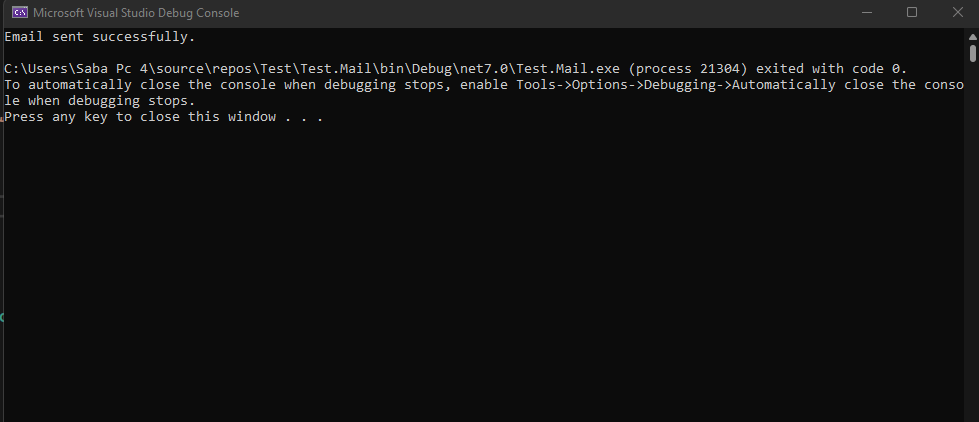
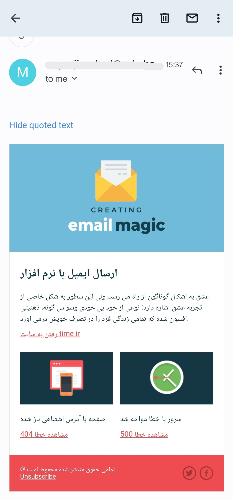

# ارسال ایمیل در دات نت 7

بی نیاز از کتابخانه جانبی، ایمیل میفرستیم.



```c#
EmailRequest mail = new EmailRequest()
{
    From = "Example@mail.com",
    To = "Example@mail.com",
    Subject = "Title of Mail",
    Body = "Title of mail",
    User = "User@mail.com",
    Pass = "********",
    Host = "mail.Host.com",
};


MailService mailService = new MailService();
mailService.Send(mail);
```

### مستندات کلاس ارسال ایمیل

این کلاس در دل برنامه جای میگیرد و با یک موجودیت ارتباط کار میکنه

```c#
public void Send(EmailRequest m)
    {
    MailMessage message = new MailMessage(m.From, m.To, m.Subject, mBody);
    message.IsBodyHtml = m.IsBodyHtml;

    SmtpClient smtpClient = new SmtpClient(m.Host);
    smtpClient.Port = 587;
    smtpClient.UseDefaultCredentials = false;
    smtpClient.Credentials = new System.Net.NetworkCredential(m.User, mPass);
    smtpClient.EnableSsl = true;

    try
    {
    smtpClient.Send(message);
    Console.WriteLine("Email sent successfully.");
    }
    catch (Exception ex)
    {
    Console.WriteLine("Error sending email: " + ex.Message);
    }
    }
```

### موجودیت رابط بین کاربر و ایمیل

```c#
public class EmailRequest
    {
        // Begin Email
        public string Host { get; set; }
        public int Port { get; set;} = 587;
        public string User { get; set; }
        public string Pass { get; set; }
        public string DisplayName { get; set; }
        public string From { get; set; }

        //  Destination Email
        public string To { get; set; }
        public string Subject { get; set; }
        public string Body { get; set; }
        public bool IsBodyHtml { get; set; } = false;
    }
```


